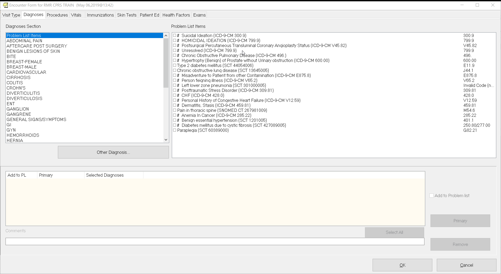
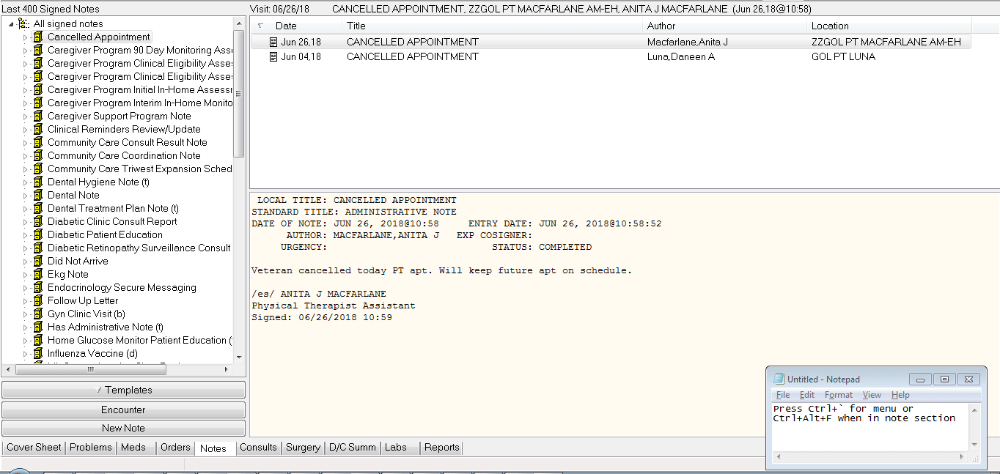
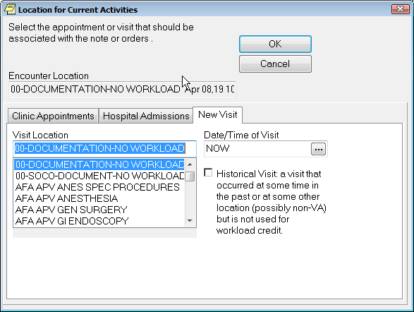
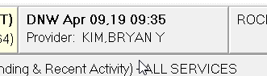
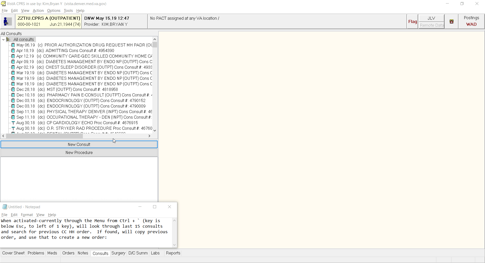
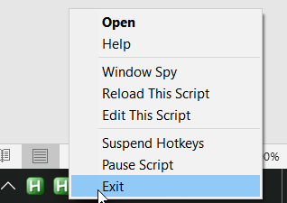

CPRS Assist
===========

CPRS Assist.exe is a tool developed with Autohotkey, used in building Consult
Toolbox and Decision Support Tool (DST), and provides advanced scripted
shortcuts for common CPRS functions, including entering in diagnoses and writing
follow up letters.

**Diagnosis Fixer**

**Problem:** When searching for ICD 10 diagnoses in CPRS, process takes too
long, and results are often inaccurate/limited

**A solution:** Lookup via Google and change diagnoses to ICD10 code within
diagnosis prompt

**Details:** Automatically reads what’s typed in the Lookup Diagnosis box,
retrieves first search in Google snippet box for “ICD 10 \<typed diagnosis\>” in
background and returns the ICD 10 code. Makes searching for diagnoses much
faster (google search takes usually 1-2 seconds, and the CPRS dialog box works
faster with direct ICD 10 codes), more tolerant to spelling errors, and will
carry the last ICD 10 description selected to the subsequent SNOMED box (when
adding to problem list):

C:\\Users\\X1\\Documents\\GitHub\\index_files\\image001.gif

**Limits:** click and drag doesn’t work while in box (but clicking on “OK”
button or enter works), sometimes will get detailed diagnoses wrong (like LEFT
glaucoma may return RIGHT glaucoma) but works well with general diagnoses.  If a
search isn’t found, will automatically open google search with above search
terms.

**Future Ideas:** If SNOMED’ing diagnoses are priority, even for diagnosis used
temporarily that is not added to problem list, we can find ways to have the
SNOMED box appear first, as it would be very easy to map a given SNOMED
diagnosis to an ICD 10 code (but not as easy the other way around as there are
more SNOMED than ICD-10 terms).

**Lab and Radiology Letterwriter**

**Problem:** Lab/radiology result letters for patients require a lot of editing
to maximize pertinent information communicated within limited space constraints

**A Solution:** Use regular expression (regex) to search and replace only
pertinent info, while leaving out all unnecessary spaces, lines and
lab/radiology verbiage

**Details:** In Lab and Reports tab, program searches for 1 week of labs and
radiology results, extracts unique results, and attaches to bottom of letter.

In the Notes tab,** Ctrl + Alt + F** starts the process:

C:\\Users\\X1\\Documents\\GitHub\\index_files\\image003.gif

**Limits**-Defaults to Rocky Mountain Regional VA address (can be easily
changed), only captures labs with [xxx] labels on end like:

PSA                            0.58     ng/ml      Ref: \<=3.99      [554]

Doesn’t capture: FOBT/FIT, path, or micro-currently work in progress

**AutoLocation00**

**Problem:** Anytime a new order is placed without a visit association, a
location prompt appears that needs to be answered the same way

**A solution:** Sets location to 00-DOCUMENTATION-NO WORKLOAD and closes the box
whenever this prompt appears (automatically done, no input needed):

C:\\Users\\X1\\Documents\\GitHub\\index_files\\image004.png

**Details:** To activate: Open program, which runs in background without further
user action needed

**Limits:  **Will need to be changed for telephone or other non 00 encounters by
clicking here:

C:\\Users\\X1\\Documents\\GitHub\\index_files\\image005.png

Doesn’t interfere w/ scheduled visit encounters.  Not for use if
00-SOCO-DOCUMENT-NO WORKLOAD is needed (Southern Colorado CBOCs).

**Community Care Home Health Copier (for both Skilled/Unskilled)**

**Problem:** Community HH orders need to be reordered frequently and take up
limited PACT time resources while requiring the same answers

**A solution:** If order is unchanged, find previous HH order and copy/paste
into new order

**Details:** When activated-currently through the Menu from Ctrl + \` (key is
below Esc, to left of 1 key), will look through last 15 consults and search for
previous CC HH order.  If found, will copy previous order, and use that to
create a new order:

C:\\Users\\X1\\Documents\\GitHub\\index_files\\image002.gif

**Limits:** Still need to review for errors, will need to change dates to
current and add diagnosis.  Will not work for brand new orders without previous
CC order or if previous order is buried under \> 15 other consults (order will
likely be too old and require changes, but threshold can be changed).

**Hotkey Functions**

Description of functions in **CPRS Asssist.exe** depends on the active tab**:**

*Globally*-

                \` (Key is below Esc, to left of 1 key)  Brings up Sign Off
Prompt (I’m trying to make one key that brings up things to sign, and if all
things are signed to go to Patient Selection page.  Basically an “I’m done with
this patient, bring up next patient” type key)

                Ctrl + \`                   Shows menu of important functions.

Note: I’m primarily focused on creating and stabilizing functions right now, and
graphics interface will be finalized afterwards.

                F5                           Refreshes info

*Meds Tab*-

Insert key-          copies meds (useful for narcotics, or expired/discontinued
meds)

Delete                  deletes meds

                Ctrl +                     \<any number digit\>-Renew meds with
x number of refills, “9” will bring up 11 Rfs.  If it doesn’t work, use \<Insert
Key\> to copy med

Ctrl+Alt+Q           Quick Meds page- Go back one for vaccinations

*Orders Tab*-

Ctrl+Alt+C           Med/surg consults

Insert key            Copies orders

Delete                  Deletes orders

*Notes Tab*-

                Ctrl + Alt + F Creates follow up letter with 1 week of labs and
radiology attached to bottom of letter

                                Limits: Defaults to RMR address, only captures
labs with [xxx] labels on end like:

PSA                            0.58     ng/ml      Ref: \<=3.99      [554]

Doesn’t capture: FOBT/FIT, path, or micro -work in progress

Ctrl+F                    Search text

Ctrl + Del              Deletes note (still prompts before deletion)

Win + V                Default note view

**Installation**:  I’ve consolidated all the programs into one “CPRS
Assist.exe”  To install, goto or ctrl+click this link: [S:\\AMB All Shared\\CPRS
Assist\\Install CPRS
Assist.bat](file:///C:\Users\X1\Documents\GitHub\Install%20CPRS%20Assist.bat).

You can also choose to start with windows.  CPRS Assist.exe is only saved
locally to Desktop and will need to be installed again with the above link for
each computer used (but only once).  Apps are not savable in Documents or U
drive, unless in a zipped folder.

A green “H” box on bottom right of screen will show for each app running (they
may be hidden, can click on bottom area to show hidden icons).  Once copied,
just double click on CPRS Assist.exe to open and run (if not already
running).  To stop the program, right click and “exit” as below.

C:\\Users\\X1\\Documents\\GitHub\\index_files\\image006.png

To exit out of program, right click and select exit.

C:\\Users\\X1\\Documents\\GitHub\\index_files\\image007.png

Disclaimer: All programs are rough drafts that are under development and are for
demonstration purposes only.  Not for general use and I am still working on edge
case issues, increasing reliability, and improving usability for a broader
audience, as well as ensuring compliance.  But hopefully, the demonstration will
give you a feel for the possibilities of automating some common workflows.

To learn more about the autohotkey tool I used to make all the apps, copy S
S:\\AMB All Shared\\CPRS Assist\\Autohotkey Program.zip and unzip to your
desktop or download directory.

<https://autohotkey.com/docs/Tutorial.htm> and

<https://www.autohotkey.com/boards/> are some helpful sites to learn more.
